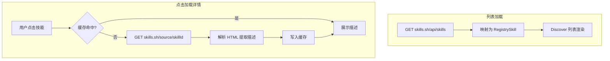

# 从 skills.sh 获取 Skills 数据

## 一、需求澄清

### 当前 vs 目标

| 维度   | 当前 (registry.json)             | 目标 (skills.sh)             |
| ------ | ------------------------------- | ---------------------------- |
| 数据源 | 本地静态 JSON，约 5 条           | 线上 API，约 4 万+           |
| 更新方式 | 随应用发布手动更新               | 实时从 skills.sh 拉取        |
| 数据字段 | 完整：description、category、tags 等 | 部分：id、name、installs、source |

### skills.sh API 情况

- **列表接口**: `https://skills.sh/api/skills`
- **排序参数**（对齐 skills.sh 首页）:
  - 全部（All Time）: 默认无 `sort` 参数
  - 趋势（Trending 24h）: `?sort=trending`
  - 热门（Hot）: `?sort=hot`
- **返回示例**:
  ```json
  {
    "skills": [
      {
        "id": "vercel-react-best-practices",
        "name": "vercel-react-best-practices",
        "installs": 61122,
        "topSource": "vercel-labs/agent-skills"
      }
    ],
    "hasMore": true
  }
  ```
- **分页**: 支持 `?limit=20&offset=0`
- **安装所需**: `repo` = source/topSource，`subPath` = skillId（即 name）
- **字段差异**: 不同 sort 下 API 可能返回 `source` 或 `topSource`，id 可能是完整路径或仅 skillId，映射层需兼容

### 字段映射与缺口

| 本地字段     | skills.sh       | 说明                 |
| ------------ | --------------- | -------------------- |
| id           | id / skillId    | 直接映射             |
| name         | name            | 直接映射             |
| repo         | topSource / source | 直接映射          |
| subPath      | skillId / name  | 即技能在 repo 内的子路径 |
| stars        | installs        | 用安装数代替「星标」   |
| author       | 从 source 解析  | 取 owner 部分        |
| description  | **无**          | 需默认值或占位       |
| category     | **无**          | 需默认值（如「未分类」） |
| tags         | **无**          | 可空数组             |
| platforms    | **无**          | 可默认 `["claude","cursor"]` |
| install_mode | **无**          | 可默认 `"sparse"`    |

---

## 二、已确认的方案

| 决策点   | 选择                                                                 |
| -------- | -------------------------------------------------------------------- |
| 描述获取 | 列表页仅展示 name、installs 等基础字段；用户**点击技能**时再请求详情页，解析并展示描述 |
| 详情页 URL | `https://skills.sh/{source}/{skillId}`（如 `https://skills.sh/vercel-labs/skills/find-skills`） |
| 描述解析 | 从详情页 HTML 中提取 SKILL.md 内容（首段或指定区域）                  |
| 描述缓存 | 已解析的描述存入缓存，避免重复请求                                    |
| 拉取入口 | 前端 React 直接 `fetch`                                              |
| 排序筛选 | 参照 skills.sh 首页：**全部 / 趋势(24h) / 热门** 三个 Tab，切换时请求不同 sort 参数 |

---

## 三、实现方案

### 数据流



### 实现步骤

1. **新增 `useSkillsFromAPI` hook**（`src/hooks/useSkillsFromAPI.ts`）
   - 支持 `sort` 参数：`''`（全部）、`'trending'`（趋势）、`'hot'`（热门）
   - 请求 `https://skills.sh/api/skills?limit=50&offset=0&sort={sort}`（sort 为空时不传）
   - 将返回数据映射为 `RegistrySkill`：`repo`=source/topSource，`subPath`=skillId，`stars`=installs，`author`=从 source 解析；兼容 `id` 为完整路径或仅 skillId 两种格式
   - 缺失字段占位：`description`=空字符串或「点击查看详情」，`category`=「未分类」，`tags`=空数组
   - 返回：`{ skills, loading, error, refetch, sort, setSort }`
2. **新增描述缓存 + 详情获取**
   - 在 store 或独立模块中维护 `Map<skillCacheKey, string>` 作为描述缓存
   - `skillCacheKey` 建议为 `${source}/${skillId}`（与详情 URL 一致）
   - 封装 `fetchSkillDescription(source, skillId): Promise<string>`
     - 先查缓存，命中则直接返回
     - 未命中则 `fetch(https://skills.sh/${source}/${skillId})`，解析 HTML 提取描述（正则或 DOMParser），写入缓存后返回
3. **SkillCard 与详情展示**
   - SkillCard 列表态：展示 name、installs（替代 stars）、author；description 显示占位或「点击查看详情」
   - 点击 SkillCard 时：打开 Modal / Drawer / 展开区域，调用 `fetchSkillDescription`，展示 loading → 描述正文
4. **Discover 页改造**
   - 使用 `useSkillsFromAPI` 替代 `registrySkills`
   - **排序 Tab**：在搜索框下方增加「全部 / 趋势(24h) / 热门」三个 Tab（样式参考 skills.sh 首页），切换时更新 `sort` 并重新请求
   - 搜索：按 name、author、source 过滤
   - 保留 InstallButton 逻辑（`repo`、`subPath` 已映射，无需改动）

### 列表页 UI 精简（移除 API 不支持的字段）

| 移除项                   | 原位置                           | 说明                         |
| ------------------------ | -------------------------------- | ---------------------------- |
| category Badge           | SkillCard 右上角                 | API 无 category              |
| tags Badge 区域          | SkillCard 底部                   | API 无 tags                  |
| 原分类筛选按钮           | Discover 页（前端开发、数据科学…） | API 无 category，已移除      |
| 按 description / tags 搜索 | Discover 搜索逻辑                | 仅保留按 name、author、source 搜索 |

**新增：** 「全部 / 趋势(24h) / 热门」排序 Tab（替代原分类，与 skills.sh 首页一致）

**保留/调整项：** name、installs（替代 stars）、author、description 占位（点击后从详情获取）

5. **本地 registry.json**
   - 不再作为发现页数据源，可保留供开发/测试或后续离线回退

### 关键文件

| 文件 | 改动 |
| ------ | ------ |
| `src/hooks/useSkillsFromAPI.ts` | 新建：列表 API 请求 + 映射 |
| `src/lib/skillDetail.ts` 或 `src/store/descriptionCache.ts` | 新建：详情请求 + HTML 解析 + 缓存 |
| `src/pages/Discover.tsx` | 使用 useSkillsFromAPI，移除 registrySkills |
| `src/components/SkillCard.tsx` | 支持无 description/tags，添加点击展开详情 |
| `src/components/SkillDetailModal.tsx` | 新建：Modal 展示描述（可选） |
| `src/data/registry.ts` | 保留 RegistrySkill 类型，可移除或保留静态 registrySkills 作 fallback |

### 待办事项

- [x] 新建 useSkillsFromAPI hook，支持 sort（全部/trending/hot），请求列表 API 并映射为 RegistrySkill
- [x] 新建 skillDetail 模块，实现详情请求、HTML 解析、描述缓存
- [x] Discover 页改用 useSkillsFromAPI，新增「全部 / 趋势(24h) / 热门」排序 Tab，搜索仅按 name/author/source
- [x] SkillCard 移除 category/tags Badge，description 占位，添加点击展开详情 Modal
